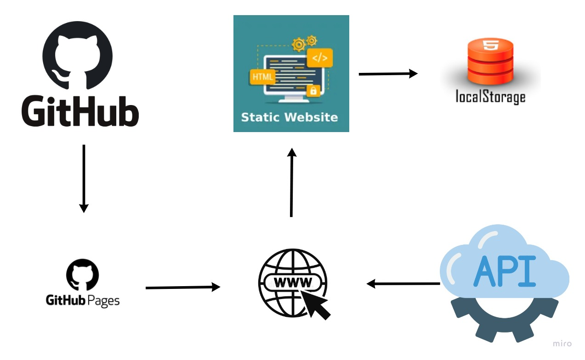

# Arquitetura da Solução

## Diagrama de componentes

A solução implementada conta com os seguintes módulos:
- **Navegador** - Interface básica do sistema  
  - **Páginas Web** - Conjunto de arquivos HTML, CSS, JavaScript e imagens que implementam as funcionalidades do sistema.
   - **Local Storage** - armazenamento mantido no Navegador, onde são implementados bancos de dados baseados em JSON. São eles: 

 - **API** - API responsavel por fornecer informações de coleta de lixo.
 - **Hospedagem** - local na Internet onde as páginas são mantidas e acessadas pelo navegador. 

O site utiliza a plataforma GitHub Pages como ambiente de hospedagem do site do projeto

## Tecnologias Utilizadas

O site ultilizara de uma API publica para fornecer ao usuario informações sobre como encontrar o ponto de coleta mais proximo com base em sua localização.

## Hospedagem

O site utiliza a plataforma GitHub Pages como ambiente de hospedagem do site do projeto.
A publicação do site é feita por meio de uma submissão do projeto (push) via git para o repositório remoto que se encontra [nesse endereço](https://github.com/ICEI-PUC-Minas-PMV-ADS/PontoVerde). Sempre que um push é feito para o repositório remoto, as mudanças são refletidas automaticamente no ambiente de hospedagem.

> **Links Úteis**:
>
> - [Website com GitHub Pages](https://pages.github.com/)
> - [Programação colaborativa com Repl.it](https://repl.it/)
> - [Getting Started with Heroku](https://devcenter.heroku.com/start)
> - [Publicando Seu Site No Heroku](http://pythonclub.com.br/publicando-seu-hello-world-no-heroku.html)
